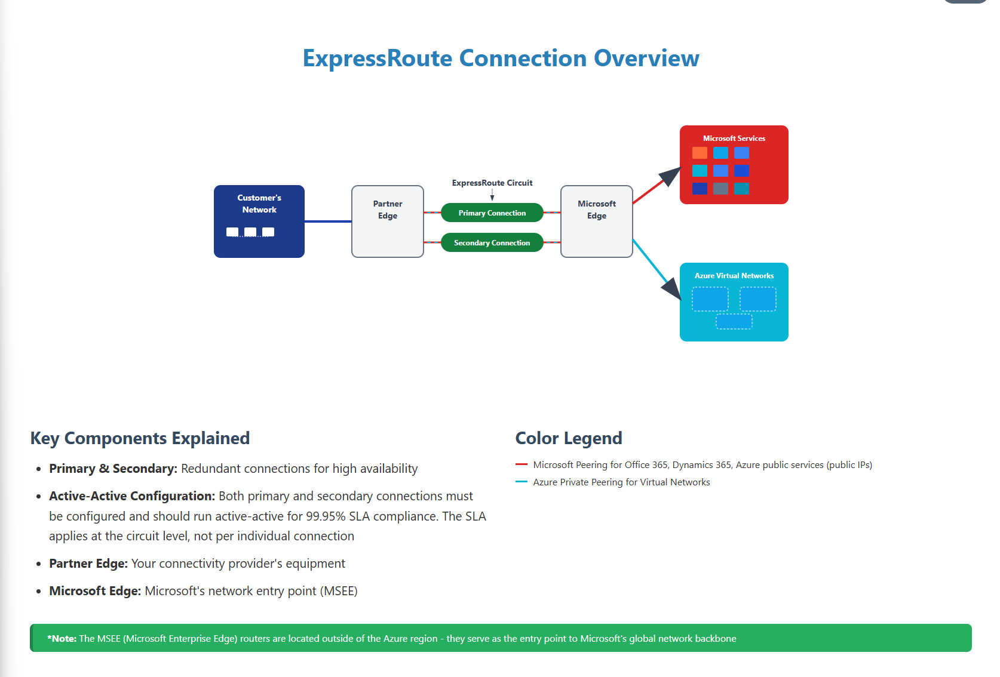
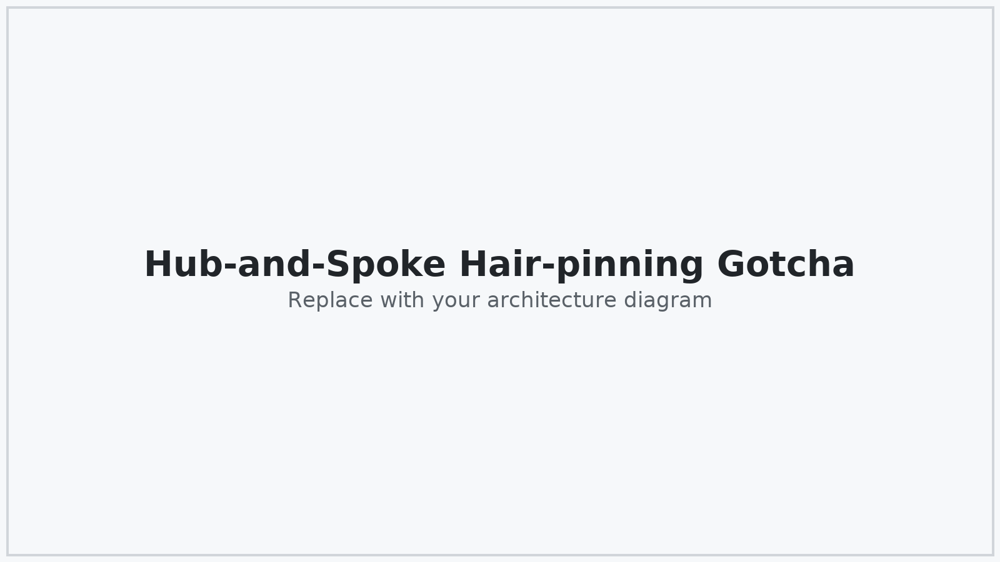
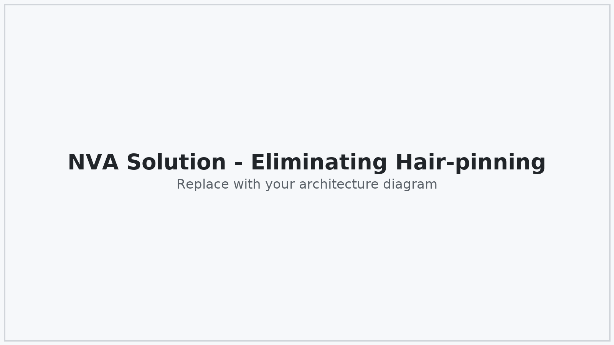

# ExpressRoute Overview & Gotchas
> Essential Foundation & Considerations for Implementation  
> _Understanding Azure ExpressRoute and avoiding common mistakes_

---

## 🧩 What is Azure ExpressRoute?
**Azure ExpressRoute** is a private, dedicated network connection between your on‑premises infrastructure and Azure.
- **Private Connection:** Traffic doesn’t traverse the public Internet
- **Dedicated Bandwidth:** Options from 50 Mbps to 100 Gbps
- **Predictable Latency:** Consistent performance vs. Internet VPN

**Typical use cases:** Hybrid apps, large data migration, disaster recovery, and regulated workloads.

> 💡 **Tip:** Think of ExpressRoute as a private fast lane into Azure for reliable, predictable connectivity.

---

## 🔗 ExpressRoute Connection Overview


**Key components**
- **Partner Edge:** Your carrier / cloud exchange provider
- **Microsoft Edge (MSEE):** Entry to Microsoft’s global network
- **Primary & Secondary connections:** Run **active‑active** for the 99.95% SLA (applies at the circuit level)

**Peering color‑legend (conceptual)**
- 🔴 **Microsoft Peering:** Public Microsoft services (M365/Power Platform/Azure public endpoints)
- 🟦 **Private Peering:** VNets/VMs and Private Endpoints

> ℹ️ **Note:** MSEE routers are outside of the Azure region and front Microsoft’s backbone.

---

## 🏗️ Architecture & Peering Types
- **ExpressRoute Circuit:** Logical connection with redundant paths, uses BGP
- **Peering Types:**
  - **Private Peering:** Connect to Azure VNets and Private Endpoints
  - **Microsoft Peering:** Microsoft public services (use sparingly; Private Endpoints often remove the need)
  - **Public Peering:** Deprecated

> ⚠️ **Complexity warning:** ER deployments require coordination across **your network**, **the provider**, **Microsoft edge**, and **Azure resources**.

---

## 🔌 Connection Models


- **🌐 Cloud Exchange Co‑location:** Cross‑connect in same facility (low‑latency, high bandwidth; requires DC presence)
- **🔗 Point‑to‑Point Ethernet:** Dedicated line from your site (predictable, but higher cost/lead time)
- **☁️ Any‑to‑Any (IPVPN/MPLS):** Leverage existing WAN provider (simple integration; shared bandwidth)
- **⚡ ExpressRoute Direct:** 10/100 Gbps ports to Microsoft’s global network (premium cost/complexity)

> ⚠️ **Gotcha:** Point‑to‑Point and IPVPN often hand both primary & secondary on the **same physical handoff** → potential single point of failure.

---

## ✅ When to Use (and When Not)
**Benefits:** Lower latency, higher throughput, private connectivity, global reach, and compliance alignment.  
**Not always necessary:** Small web apps or cost‑sensitive scenarios may do fine with Internet + VPN/PE.

---

## 🛠️ Configuration Challenges (Common)
- **BGP ASNs:** Don’t reuse the same local/remote ASN; avoid Microsoft‑reserved ASNs (65515–65520)
- **IP Pairing:** Microsoft uses the **second usable IP** (.130); customer uses the **first** (.129) on the peering /30
- **VLAN Consistency:** Private Peering VLAN IDs must match end‑to‑end (Azure → Provider → Switch/Firewall)

> ⚠️ **Reality check:** BGP config errors account for most first‑day connectivity failures.

---

## 🧰 Gateway Configuration Gotchas
- **Gateway vs Circuit Sizing:** A 2 Gbps circuit with a 1 Gbps gateway → **max 1 Gbps**
- **One‑way changes:** Circuits and gateway SKUs can be **upgraded** but not **downgraded**

---

## 🧮 Advanced Technical Considerations
- **Route limits:** Private Peering ~4,000 IPv4 prefixes (Premium: ~10,000). Growth in Microsoft prefixes can push you over.
- **Latency vs Throughput:** TCP performance depends on RTT and windowing; a 1‑Gbps circuit at ~100 ms ≠ full gigabit.
- **Hub‑and‑Spoke hair‑pinning:** Without an NVA/Route Server, **spoke→spoke** traffic may hair‑pin via MSEE and back, adding latency and ER dependency.

---

## 🔁 Hub‑and‑Spoke Hair‑pinning (Gotcha)


**Problem**
- Spoke1 → Hub → **MSEE** → Hub → Spoke2 path
- Adds latency and creates failure dependency on ER

**Solutions**
- **NVA in hub** (Azure Firewall / 3rd‑party)
- **Azure Route Server** for BGP injection
- **Azure Virtual WAN**
- **Direct spoke‑to‑spoke** peering where appropriate

---

## 🧱 NVA Solution: Eliminating Hair‑pinning


**Benefits**
- Keeps Azure‑to‑Azure traffic on the Azure backbone
- Lower latency, reduced ER dependency
- Central policy & inspection; cost optimization

> 🔧 **Key requirement:** Use UDRs to steer spoke‑to‑spoke via the NVA (or leverage Route Server with NVA for dynamic routing).

---

## 🔐 Security Misconfigurations
- **Encryption:** ER does **not** encrypt by default. Use **MACsec** (ER Direct only) or **IPsec over ER**.
- **Segmentation bypass:** ER can circumvent existing security zones if not planned carefully.
- **Default route pitfalls:** Advertising 0.0.0.0/0 over ER pulls Internet egress on‑prem; when withdrawn, Azure system routes can restore Internet egress unexpectedly.

> 🛎️ **Monitoring gap:** BGP route table logs may not update in real time → visibility gaps during incidents.

---

## 🚦 Performance & Routing Complexities
- **Geography matters:** Fiber routes (not straight line) drive RTT.
- **Load balancing:** Multiple circuits can create latency variation.
- **Gateway constraints:** Check SKU limits and connection concurrency.

---

## 🧭 Troubleshooting Checklist (Field‑Ready)
1. Verify **circuit state**, **peering state**, and **BGP session** on both links
2. Confirm **VLAN tagging** end‑to‑end and IP/ASN assignment
3. Check **route limits**, **prefix filters**, and **max‑prefix thresholds**
4. Validate **gateway SKU**, **effective routes**, and **UDRs**
5. Test **path selection** (traceroute), **latency**, and **throughput** (iperf/TCP windowing)
6. Review **NVA rules** (if present) and **Route Server**/BGP health
7. For M365/Azure PaaS, prefer **Private Endpoints** over Microsoft Peering

---

## 📚 References & Next Steps
- Replace placeholders with your own **architecture diagrams** (PNG/SVG/Mermaid)
- Consider adding **as‑built** docs for your env (ASNs, VLANs, subnets, gateways, circuits, policies)
- Add a **runbook** for ER incident response and change management

---

### Repository Structure
```
/images
  expressroute-overview.png
  connection-models.png
  hairpinning-gotcha.png
  nva-solution.png
README.md
```

---

### Quick Start (GitHub CLI)
```bash
# 1) Initialize
git init
git add .
git commit -m "Initial commit - ExpressRoute Overview & Gotchas"

# 2) Create and push to GitHub (public)
# Replace <your-github-username> if needed
gh repo create <your-github-username>/expressroute-overview-gotchas --public --source=. --remote=origin --push
```